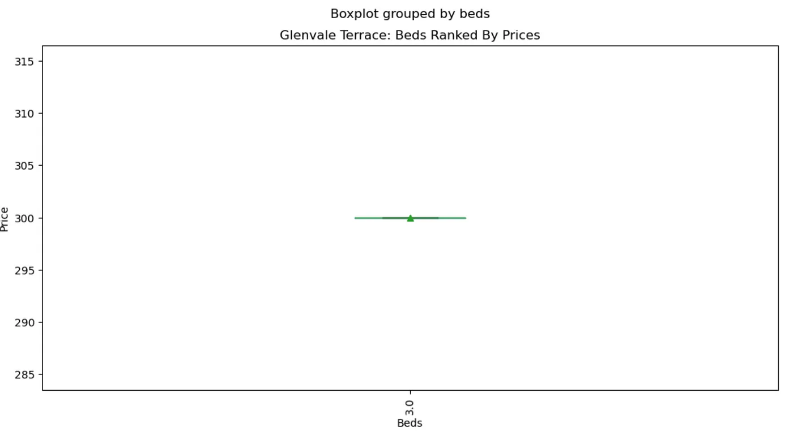

# Jamaica Plain Airbnb data analysis
#### by Huynh Nhut NGUYEN

## 1. Overview
> My Medium blog post: [Would you like to see more money going to your company?](https://medium.com/@nhuttommy/would-you-like-to-see-more-money-going-to-your-company-a2d635848aa5)

## 2. Data Explanation
The Kaggle archive data contains three raw datasets.
With the listings.csv and the calendar.csv, I pre-processed those two datasets, those were joined to create cleaned_airbnb_data.csv for my project. The reviews.csv is not touched.

The raw data:
- reviews.csv
- calendar.csv
- listings.csv

The cleaned data:
- cleaned_airbnb_data.csv is created by joining calendar.csv to listings.csv

The raw data is contained in data.zip

## 3. Installation and Workflow Explanation
### 3.1 Enviroment

Local **Jupyter Notebook**

### 3.2 How to run?

In the Terminal, let's type:
> jupyter notebook

To start the jupyter notebook, then extract data from the data.zip
Finally, open **nhuttommy_nd025_project_1.ipynb** to run the code. 

### 3.3 Libraries will be used

- Folium (no restricted version)
- Pandas (no restricted version)
- Matplotlib.pylot (no restricted version)

### 3.4 Data Cleaning

- Select needed columns
- Distorted “street” column
- Missing and categorical data
- Data type correcting: int, timestamp

### 3.5 Analysis

Processing the information and applying assumptions to arrive at the answers after question analysis.

## Answer three question as following

1. Let’s imagine that a group of vacationers travels to Jamaica Plain, Massachusetts, on June 8, 2017, and wishes to remain there. What space is now accessible to them?
2. How much does it cost to move between streets in Jamaica Plain?
3. Supposedly, the facilities and lodging design may have an impact on pricing discrepancies. (room type, facilities)

## 4. Details
### What are livable hotels in Jamaica Plain at the time tourists come?

An example that tourists will come to the Jamaica Plain on 8-June-2017 for summer vacation. What are livable hotels for them?

I first plotted the data using the World Map after date-filtering it. As we can see, there are a variety of open places on numerous streets. In the file notebook, try making changes to the map.

### What is the price difference among streets in the Jamaica Plain?

The data is then split up by street, the mean prices are calculated, and the number of businesses in each street is counted. By tallying up the number of businesses on each street, we can observe that some of them contain a lot of hotels. Are there still disparities in hotel costs on particular streets, or are they about the same?

The range of typical prices is between 100 and 300. Extreme prices, however, might sometimes have an effect on pricing that is more common. One is more than $450. As a result, prices fluctuate not just from street to street but even from block to block. Obviously, the type of accommodation and other facilities might vary. Let’s investigate whether the supposition is true or false.

### Price variations by facility

Boxplot category characteristics while attempting. By comparing the amenities offered by each location, we can observe that the rates vary.

Rates differ according to the number of beds and room type, as is evident. However, there are a number of outliers with beds = 1, real_bed, room_type, and property_type = Apartment or House or Bed & Breakfast. This is so that when using a department filter and a boxplot in beds and price, we may see the same price order by number of beds as seen below.

Keeping an eye on the busy streets. We can see from the amenities they provide that the prices keep changing.

## 5. Summary

In general, prices for different lodging options on a specific day (2017, June 8) depend both on the street (some busy streets have extremely high charges) and the facilities provided. such as the number of beds, the style of lodging, such as an apartment or home, and other amenities displayed in the boxplots above.

Data used in a recommendation system for tourists can be filtered with the aid of the findings of both the analysis and the first-hand observation. To enhance the quality of our deep dive analysis, we can include some mocked_user-requirements.

## 6. Authors, Acknowledgements, Licensing

- The Kaggle data URL: https://www.kaggle.com/datasets/airbnb/boston
- This dataset is part of Airbnb Inside, and the original source can be found at: http://insideairbnb.com/get-the-data/
